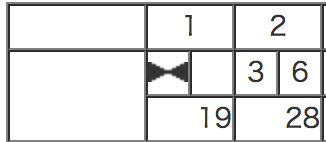
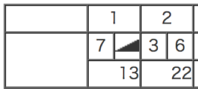
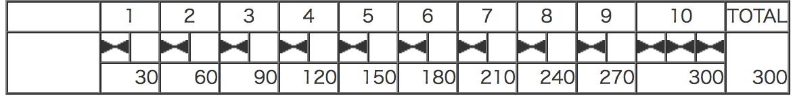

  
  
ボウリングゲーム
---
  
## 基本仕様
  
+ 1投目で10ピンすべて倒したら、ストライク
+ スペアは、2投目で10ピンすべて倒したということ
+ 1投目が0点で2投目で10ピン倒してもスペア
+ ガターは、1投目に横のガターに落ちて1ピンも倒せないこと
+ ボウリングでの最高得点は300点で、パーフェクトと言う
  
## ユースケース
  

  
  
### ユースケース１：ストライク
  

```ruby
require 'test/unit'
class Game
  def initialize
    @throws = Array.new    
    @current_throw = 0    
    @score = Score.new(@throws)
  end
  def add(pin)
    @throws[@current_throw] = pin    
    @current_throw += 1
  end
  def score
    @score.score
  end  
end
class Score
  def initialize(throw)
    @throws = throw
  end
  def score
    first_throw = @throws[0]
    second_throw = @throws[1]
    third_throw = @throws[2]
    if first_throw == 10
      first_frame_score = second_throw + third_throw      
      second_frame_score = second_throw + third_throw
      @score = 10 + first_frame_score + second_frame_score
    end
  end
end
class TestGame < Test::Unit::TestCase
  def test_strike
    g = Game.new
    g.add(10)
    g.add(3)
    g.add(6)
    assert_equal 28, g.score    
  end
end
```
<pre class="language-text">Loaded suite /Users/k2works/Projects/k2works/bowling_game_ruby/docs/o5c2aplph_code_chunk
Started
.

Finished in 0.000594 seconds.
------
1 tests, 1 assertions, 0 failures, 0 errors, 0 pendings, 0 omissions, 0 notifications
100% passed
------
1683.50 tests/s, 1683.50 assertions/s
</pre>
  
### ユースケース２：スペア
  

```ruby
require 'test/unit'
class Game
  def initialize
    @throws = Array.new    
    @current_throw = 0    
    @score = Score.new(@throws)
  end
  def add(pin)
    @throws[@current_throw] = pin    
    @current_throw += 1
  end  
  
  def score        
    @score.score
  end
end
class Score
  def initialize(throws)
    @throws = throws
  end
  def score    
    first_throw = @throws[0]
    second_throw = @throws[1]
    third_throw = @throws[2]
    fourth_throw = @throws[3]
    score = first_throw + second_throw
    if score == 10
      spare = score + third_throw
      @score = spare + third_throw + fourth_throw
    else
      @score = score + third_throw + fourth_throw
    end    
  end
end
class TestGame < Test::Unit::TestCase
  def test_spare
    g = Game.new
    g.add(7)
    g.add(3)
    g.add(3)
    g.add(6)
    assert_equal 22, g.score
  end
end
```
<pre class="language-text">Loaded suite /Users/k2works/Projects/k2works/bowling_game_ruby/docs/mt9anbfqa_code_chunk
Started
.

Finished in 0.000575 seconds.
------
1 tests, 1 assertions, 0 failures, 0 errors, 0 pendings, 0 omissions, 0 notifications
100% passed
------
1739.13 tests/s, 1739.13 assertions/s
</pre>
  
### ユースケース３：ガター
  

```ruby
require 'test/unit'
class Game
  def initialize
    @throws = Array.new(9,0)    
    @current_throw = 0
    @score = Score.new(@throws)
  end
  def add(pin)
    @throws[@current_throw] = pin    
    @current_throw += 1
  end
  def score
    @score.score
  end
end
class Score
  def initialize(throws)
    @throws = throws    
  end
  def score
    score = 0
    frame = 0    
    @throws.each do |throw|        
      score += throw
      frame += 1      
      puts "#{frame}:#{@score}"      
    end
    score
  end  
end
class TestGame < Test::Unit::TestCase
  def test_strike
    g = Game.new
    10.times do
      g.add(0)
    end
    assert_equal 0, g.score    
  end
end
```
<pre class="language-text">Loaded suite /Users/k2works/Projects/k2works/bowling_game_ruby/docs/8378b66sp_code_chunk
Started
1:
2:
3:
4:
5:
6:
7:
8:
9:
10:
.

Finished in 0.000599 seconds.
------
1 tests, 1 assertions, 0 failures, 0 errors, 0 pendings, 0 omissions, 0 notifications
100% passed
------
1669.45 tests/s, 1669.45 assertions/s
</pre>
  
### ユースケース４：パーフェクト
  

```ruby
require 'test/unit'
class Game
  def initialize    
    @throws = Array.new(10,0)
    @current_throw = 0    
    @score = Score.new(@throws)
  end
  def add(pin)
    @throws[@current_throw] = pin    
    @current_throw += 1
  end
  def score       
    @score.score
  end
end
class Score
  def initialize(throws)
    @throws = throws
  end
  def score
    score = 0
    frame = 0
    @throws.each do |throw|      
      pre_throw = throw      
      score += 10 + pre_throw + throw
      frame += 1      
      puts "#{frame}:#{@score}"      
    end
    score
  end
end
class TestGame < Test::Unit::TestCase
  def test_strike
    g = Game.new
    10.times do
      g.add(10)
    end
    assert_equal 300, g.score    
  end
end
```
<pre class="language-text">Loaded suite /Users/k2works/Projects/k2works/bowling_game_ruby/docs/szshl3md3_code_chunk
Started
1:
2:
3:
4:
5:
6:
7:
8:
9:
10:
.

Finished in 0.000623 seconds.
------
1 tests, 1 assertions, 0 failures, 0 errors, 0 pendings, 0 omissions, 0 notifications
100% passed
------
1605.14 tests/s, 1605.14 assertions/s
</pre>
  
  
### ユースケース５：サンプルゲーム
  

```ruby
require 'test/unit'
class Game
  def initialize    
    @throws = Array.new(21,0)    
    @current_throw = 0
    @score = Score.new(@throws)    
  end
  def add(pin)
    @throws[@current_throw] = pin    
    @current_throw += 1
  end
  def score       
    @score.score    
  end
end
class Score
  def initialize(throws)
    @throws = throws
  end
  def score
    133    
  end
end
class TestGame < Test::Unit::TestCase
  def test_strike
    g = Game.new
    pins = [1, 4, 4, 5, 6, 4, 5, 5, 10, 0, 1, 7, 3, 6, 4, 10, 2, 8, 6]
    pins.each do |pin|
      g.add(pin)
    end
    assert_equal 133, g.score    
  end
end
```
<pre class="language-text">Loaded suite /Users/k2works/Projects/k2works/bowling_game_ruby/docs/10pexy0oa_code_chunk
Started
.

Finished in 0.000554 seconds.
------
1 tests, 1 assertions, 0 failures, 0 errors, 0 pendings, 0 omissions, 0 notifications
100% passed
------
1805.05 tests/s, 1805.05 assertions/s
</pre>
  
## コアモデル
  

  
  
## 参照
  
+ [ボウリング](https://ja.wikipedia.org/wiki/%E3%83%9C%E3%82%A6%E3%83%AA%E3%83%B3%E3%82%B0 )
  