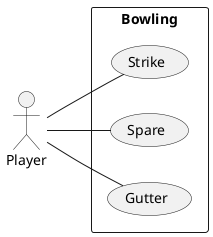
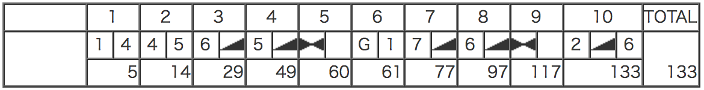
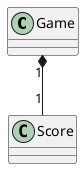

---
markdown:
  image_dir: /docs/assets
  path: README.md
  ignore_from_front_matter: true
  absolute_image_path: false
---

ボウリングゲーム
---

## 基本仕様
+ 1投目で10ピンすべて倒したら、ストライク
+ スペアは、2投目で10ピンすべて倒したということ
+ 1投目が0点で2投目で10ピン倒してもスペア
+ ガターは、1投目に横のガターに落ちて1ピンも倒せないこと
+ ボウリングでの最高得点は300点で、パーフェクトと言う

## ユースケース

### ユースケース１：ストライク

### ユースケース２：スペア

### ユースケース３：ガター

### ユースケース４：パーフェクト

### ユースケース５：サンプルゲーム

## コアモデル

## 参照
+ [ボウリング](https://ja.wikipedia.org/wiki/%E3%83%9C%E3%82%A6%E3%83%AA%E3%83%B3%E3%82%B0)