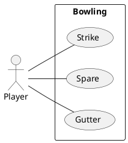
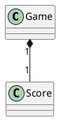

---
markdown:
  image_dir: /docs/assets
  path: README.md
  ignore_from_front_matter: true
  absolute_image_path: false
---

ボウリングゲーム
---

## 基本仕様
+ 1投目で10ピンすべて倒したら、ストライク
+ スペアは、2投目で10ピンすべて倒したということ
+ 1投目が0点で2投目で10ピン倒してもスペア
+ ガターは、1投目に横のガターに落ちて1ピンも倒せないこと
+ ボウリングでの最高得点は300点で、パーフェクトと言う

## ユースケース


### ユースケース１：ストライク

```ruby {cmd=true}
require 'test/unit'

class Game
  def initialize
    @throws = Array.new    
    @current_throw = 0    
    @score = Score.new(@throws)
  end

  def add(pin)
    @throws[@current_throw] = pin    
    @current_throw += 1
  end

  def score
    @score.score
  end  
end

class Score
  def initialize(throw)
    @throws = throw
  end

  def score
    first_throw = @throws[0]
    second_throw = @throws[1]
    third_throw = @throws[2]

    if first_throw == 10
      first_frame_score = second_throw + third_throw      
      second_frame_score = second_throw + third_throw
      @score = 10 + first_frame_score + second_frame_score
    end
  end
end

class TestGame < Test::Unit::TestCase
  def test_strike
    g = Game.new
    g.add(10)
    g.add(3)
    g.add(6)
    assert_equal 28, g.score    
  end
end
```

### ユースケース２：スペア

```ruby {cmd=true}
require 'test/unit'

class Game
  def initialize
    @throws = Array.new    
    @current_throw = 0    
    @score = Score.new(@throws)
  end

  def add(pin)
    @throws[@current_throw] = pin    
    @current_throw += 1
  end  
  
  def score        
    @score.score
  end
end

class Score
  def initialize(throws)
    @throws = throws
  end

  def score    
    first_throw = @throws[0]
    second_throw = @throws[1]
    third_throw = @throws[2]
    fourth_throw = @throws[3]

    score = first_throw + second_throw
    if score == 10
      spare = score + third_throw
      @score = spare + third_throw + fourth_throw
    else
      @score = score + third_throw + fourth_throw
    end    
  end
end

class TestGame < Test::Unit::TestCase
  def test_spare
    g = Game.new
    g.add(7)
    g.add(3)
    g.add(3)
    g.add(6)
    assert_equal 22, g.score
  end
end
```

### ユースケース３：ガター

```ruby {cmd=true}
require 'test/unit'

class Game
  def initialize
    @throws = Array.new(9,0)    
    @current_throw = 0
    @score = Score.new(@throws)
  end

  def add(pin)
    @throws[@current_throw] = pin    
    @current_throw += 1
  end

  def score
    @score.score
  end
end

class Score
  def initialize(throws)
    @throws = throws    
  end

  def score
    score = 0
    frame = 0    
    @throws.each do |throw|        
      score += throw
      frame += 1      
      puts "#{frame}:#{@score}"      
    end
    score
  end  
end

class TestGame < Test::Unit::TestCase
  def test_strike
    g = Game.new
    10.times do
      g.add(0)
    end
    assert_equal 0, g.score    
  end
end
```

### ユースケース４：パーフェクト

```ruby {cmd=true}
require 'test/unit'

class Game
  def initialize    
    @throws = Array.new(10,0)
    @current_throw = 0    
    @score = Score.new(@throws)
  end

  def add(pin)
    @throws[@current_throw] = pin    
    @current_throw += 1
  end

  def score       
    @score.score
  end
end

class Score
  def initialize(throws)
    @throws = throws
  end

  def score
    score = 0
    frame = 0
    @throws.each do |throw|      
      pre_throw = throw      
      score += 10 + pre_throw + throw
      frame += 1      
      puts "#{frame}:#{@score}"      
    end
    score
  end
end

class TestGame < Test::Unit::TestCase
  def test_strike
    g = Game.new
    10.times do
      g.add(10)
    end
    assert_equal 300, g.score    
  end
end
```


### ユースケース５：サンプルゲーム

```ruby {cmd=true}
require 'test/unit'

class Game
  def initialize    
    @throws = Array.new(21,0)    
    @current_throw = 0
    @score = Score.new(@throws)    
  end

  def add(pin)
    @throws[@current_throw] = pin    
    @current_throw += 1
  end

  def score       
    @score.score    
  end
end

class Score
  def initialize(throws)
    @throws = throws
  end

  def score
    133    
  end
end

class TestGame < Test::Unit::TestCase
  def test_strike
    g = Game.new
    pins = [1, 4, 4, 5, 6, 4, 5, 5, 10, 0, 1, 7, 3, 6, 4, 10, 2, 8, 6]
    pins.each do |pin|
      g.add(pin)
    end
    assert_equal 133, g.score    
  end
end
```

## コアモデル


## 参照
+ [ボウリング](https://ja.wikipedia.org/wiki/%E3%83%9C%E3%82%A6%E3%83%AA%E3%83%B3%E3%82%B0)