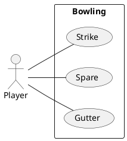
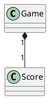

---
markdown:
  image_dir: /docs/assets
  path: README.md
  ignore_from_front_matter: true
  absolute_image_path: false
---

ボウリングゲーム
---

## 基本仕様
+ 1投目で10ピンすべて倒したら、ストライク
+ スペアは、2投目で10ピンすべて倒したということ
+ 1投目が0点で2投目で10ピン倒してもスペア
+ ガターは、1投目に横のガターに落ちて1ピンも倒せないこと
+ ボウリングでの最高得点は300点で、パーフェクトと言う

## ユースケース


### ユースケース１：ストライク
```ruby {cmd=true}
require 'test/unit'

class Game
  def initialize
    @score = 0
  end
  
  def add(pin)
    @score =+ pin
  end

  def score
    @score
  end
end

class TestGame < Test::Unit::TestCase
  def test_strike
    g = Game.new
    g.add(10)
    assert_equal 10, g.score    
  end
end
```

### ユースケース２：スペア
```ruby {cmd=true}
require 'test/unit'

class Game
  def initialize
    @score = 0
    @current_throw = 0
    @throws = Array.new(21,0)
  end

  def add(pin)
    @throws[@current_throw] = pin    
    @current_throw += 1
  end  

  def score        
    first_throw = @throws[0]
    second_throw = @throws[1]
    third_throw = @throws[2]

    score = first_throw + second_throw
    if score == 10
      @score = score + third_throw
    else
      @score = score
    end
  end
end

class TestGame < Test::Unit::TestCase
  def test_spare
    g = Game.new
    g.add(7)
    g.add(3)
    g.add(3)
    assert_equal 13, g.score
  end
end
```

### ユースケース３：ガター

### ユースケース４：パーフェクト

### ユースケース５：サンプルゲーム


## コアモデル


## 参照
+ [ボウリング](https://ja.wikipedia.org/wiki/%E3%83%9C%E3%82%A6%E3%83%AA%E3%83%B3%E3%82%B0)